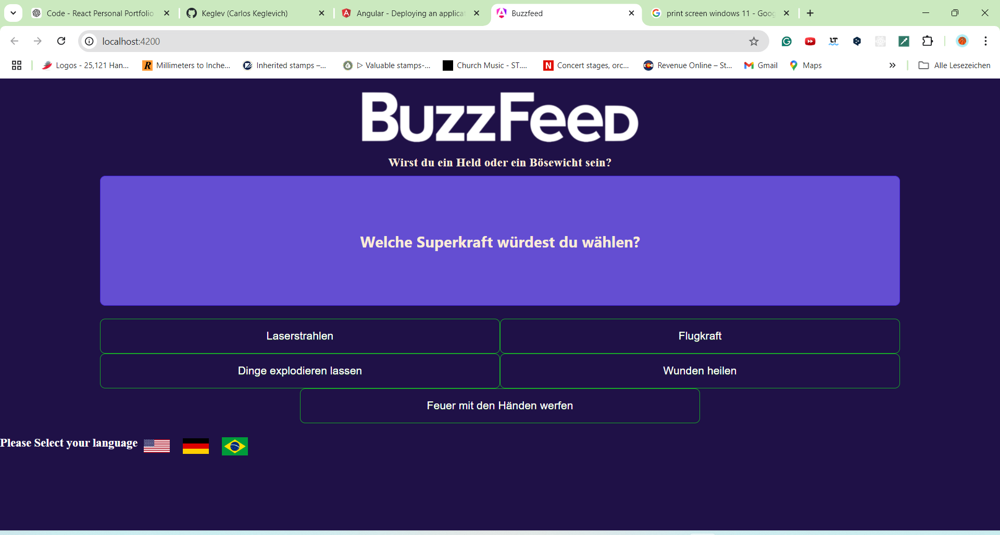

## About
An application to mimic Buzzfeed to answer questions. Available in English, German, and Portuguese

# Buzzfeed APP

This mimics a very-know entertainment app from Buzzfeed company. It is part of a known Pop Culture. 
It gives questions about something and the user answers based on his feelings or desires. In the end gives you a note or opinion.
It is used for fetching data from users or engaging a trend.
Very useful for creating posts on Instagram, Facebook, Media Site News, Click Baits, etc. 

# Table of Contents

[Features](#Features) 

[Screenshots](#Screenshots)

[Installation](#Instalation)

[Usage](#Usage)

[Available Scripts](#Available-Scripts)

[Technologies](#Technologies)

[API Integration](#API-Integration)

[Contributing](#Contributing)

# Features

 This app is for entertainment only. The user answers a series of questions.
 Gives an answer based on the choices made by the user.
 The user can choose if he wants to answer the questions in English, German or Portuguese
 

 # Screenshots

 

 # Installation
To run this app locally, follow these steps:

1. Clone the repository:

  git clone https://github.com/your-username/buzzfeed.git

2. Navigate to the project directory:
   
  cd BuzzFeed

3. Install the dependencies:

   npm install

 4. Start the development server:
 5. 
   ng serve

## Usage

 excellent for creating click-bait websites 
 This idea makes the user interact more with the website.
 Excellent at fetching data or seeing a trend in a market.

## Available Scripts

In the project directory, you can run:
   
This project was generated with [Angular CLI](https://github.com/angular/angular-cli) version 18.1.0.

## Development server

Run `ng serve` for a dev server. Navigate to `http://localhost:4200/`. The application will automatically reload if you change any of the source files.

## Code scaffolding

Run `ng generate component component-name` to generate a new component. You can also use `ng generate directive|pipe|service|class|guard|interface|enum|module`.

## Build

Run `ng build` to build the project. The build artifacts will be stored in the `dist/` directory.

## Running unit tests

Run `ng test` to execute the unit tests via [Karma](https://karma-runner.github.io).

## Running end-to-end tests

Run `ng e2e` to execute the end-to-end tests via a platform of your choice. To use this command, you need to first add a package that implements end-to-end testing capabilities.

## Further help

To get more help on the Angular CLI use `ng help` or go check out the [Angular CLI Overview and Command Reference](https://angular.dev/tools/cli) page.

## Technologies:

Frontend: *Angular, Angular Router

Backend: *Typescript

Styling: *CSS

## Contributing

Contributions are welcome! Here's how you can contribute:

1. Fork the repository.
2. Create a new branch (git checkout -b feature/YourFeatureName).
3. Commit your changes (git commit -m 'Add some feature').
4. Commit your changes (git commit -m 'Add some feature').
5. Open a pull request.
